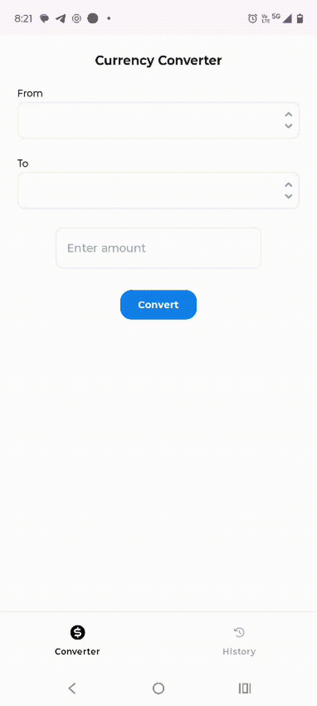

# 📌 CurrencyConverter

## 📖 Description
**CurrencyConverter** is an Android mobile application built with **Kotlin** that allows users to convert currencies in real time using data from an external exchange rate API.  
It is designed with a clean architecture approach, ensuring scalability, maintainability, and a smooth user experience.

---

## ✨ Main Features
- 💱 Real-time currency conversion. 
- 🌐 Fetches updated exchange rates from an external API.
- 📱 Simple, modern, and user-friendly interface. 
- 🏛️ Built following **Clean Architecture** principles for better maintainability.

---

## 🎥 Demo in Action

<p align="center">
  
</p>

---

## 🛠️ Technologies Used
- **Kotlin** → Main development language.  
- **Android SDK** → Mobile development framework.  
- **Coroutines & Flow** → Asynchronous and reactive programming.
- **Dagger Hilt** → Dependency Injection
- **Room Database, MySQL** → Data persistence
- **Retrofit** → REST API client for fetching exchange rates.  
- **ViewModel (Jetpack)** → Lifecycle-aware state management.  
- **LiveData / StateFlow** → Reactive data observation.  
- **Clean Architecture + MVVM** → Clear separation of concerns and modular design.

---

## 🚀 Installation & Execution

### 1. Clone the repository
```bash
git clone https://github.com/daniospina9/CurrencyConverter.git
cd CurrencyConverter
```
### 2. Open in Android Studio

- Import the project as an existing Gradle project.

- Sync the dependencies.

- Connect your device or use an Android emulator.

- Run the project with the Run ▶️ button.

- Or, if you prefer, download the app-release-unsigned.apk directly and run it on your own device.

---

## 🤝 Contributions
Contributions are welcome!
